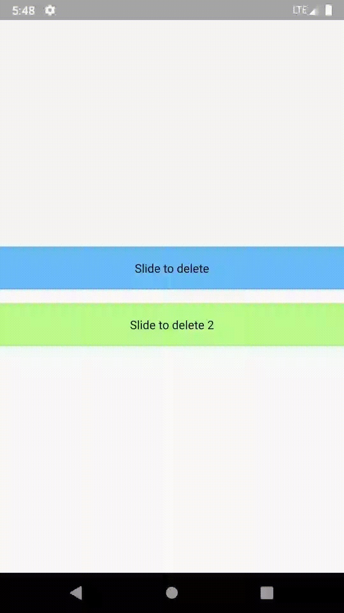

# SlideToDelete


[](https://jitpack.io/#MinSeungHyun/SlideToDelete)
[](https://github.com/MinSeungHyun/SlideToDelete/blob/master/LICENSE)
<br>
Not a RecyclerView, Just a View<br>
But it can also be used in RecyclerVIew<br>



## Quick Start
1. Add this in your `build.gradle (app)` at the end of project
```gradle
allprojects {
	repositories {
		maven { url 'https://jitpack.io' }
	}
}

dependencies {
	implementation 'com.github.MinSeungHyun:SlideToDelete:v1.5'
}
```
2. In your xml (Attributes and Views are not important)
```xml
<!--container-->
<RelativeLayout
    android:id="@+id/container"
    android:layout_width="match_parent"
    android:layout_height="wrap_content"
    android:layout_marginBottom="16dp"
    android:gravity="center"
    tools:ignore="HardcodedText">

    <!--This view will be shown when slided-->
    <TextView
        android:id="@+id/deletedTV"
        android:layout_width="match_parent"
        android:layout_height="wrap_content"
        android:layout_alignBottom="@+id/text"
        android:layout_alignParentTop="true"
        android:background="#FF2E2E"
        android:gravity="center"
        android:text="deleted"
        android:textColor="@android:color/white"
        android:textSize="18sp"
        android:textStyle="bold" />
	
    <!--This view is the content-->
    <TextView
        android:id="@+id/contentTV"
        android:layout_width="match_parent"
        android:layout_height="wrap_content"
        android:background="#69BEFF"
        android:gravity="center"
        android:padding="16dp"
        android:text="Slide to delete"
        android:textColor="@android:color/black" />
</RelativeLayout>
```

3. kotlin
```kotlin
deletedTV.enableSlideToDelete(container, contentTV, waitingTime) {
    //Do somthing when deleted
}
```
or
```kotlin
val doWhenDeleted = { container: ViewGroup ->
     //Do somthing when deleted
}
deletedTV.enableSlideToDelete(container, contentTV, waitingTime, doWhenDeleted)
```

example
```kotlin
deletedTV.enableSlideToDelete(container, contentTV, 2000) {
    it.visibility = View.GONE
}
```
That's it!
